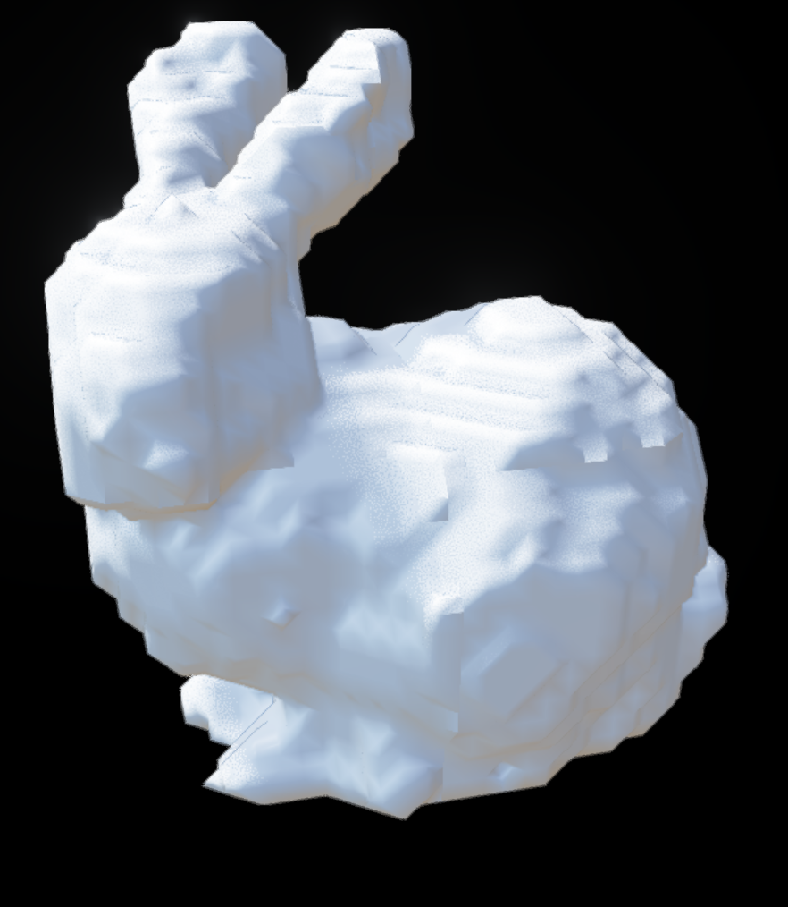
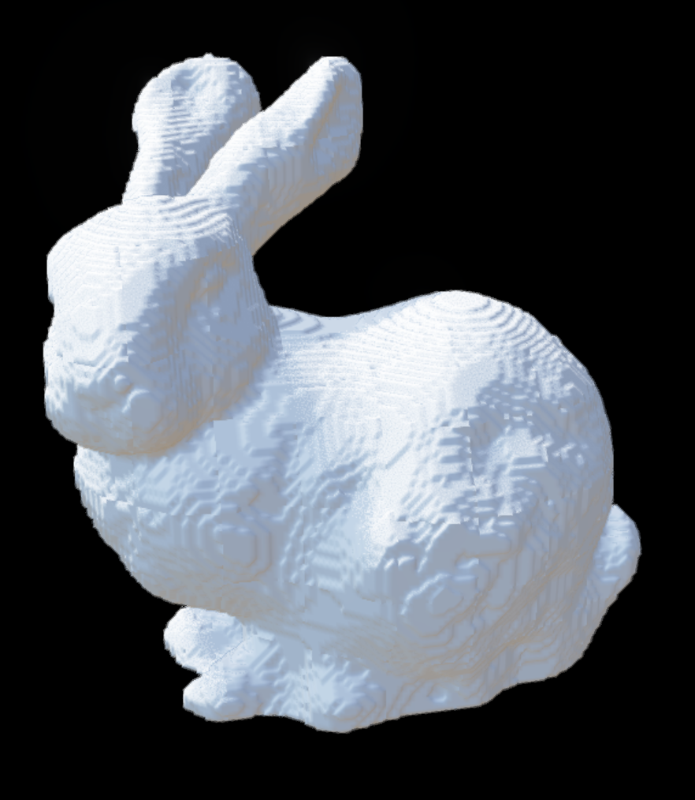

# Charlie's Voxel Octree Library

A fast, memory-efficient sparse voxel octree library with GPU-accelerated mesh-to-octree voxelization. Minimizes octree memory usage by bit packing the lowest octree level and using 32 bit pointers to reference child nodes (includes 32b pool allocator). Includes CPU and GPU accelerated mesh voxelization using OpenCL and [tinyBVH](https://github.com/jbikker/tinybvh).

### Example: Stanford bunny voxelization

| 128³ | 512³ |
|:---:|:---:|
|  |  |
| **<0.1 s** · 174 kB | **~8 s** · 2.8 MB |

Timings measured on a Mac M1 GPU.

## Features

### BitOctree — space-efficient sparse storage

The core data structure is a **sparse bit octree** (`BitOctree`) that stores voxel solid/empty status with minimal memory overhead:

- **1 bit per leaf voxel** - (also have 8bit version if you want to store more information per voxel)
- **Pool-allocated branch nodes** — child pointers are 32-bit memory pool indices, saving memory compared to raw pointers and allowing fast serialization
- **Binary serialization** — serialization is achieved by just dumping the whole pool to a file (extremely fast)

- **Thread Safety** — Separate read and write locks for the octree

### Mesh → Octree (GPU-accelerated)

`MeshOctreeGen` voxelizes triangle meshes into a `VoxelOctree` using adaptive top-down refinement:

1. Build a **BVH** over mesh triangles ([tinyBVH](https://github.com/jbikker/tinybvh))
2. For each candidate voxel, classify it as **inside**, **outside**, or **intersecting** the mesh surface
3. Subdivide intersecting voxels down to the target resolution

**GPU path (OpenCL):** When built with `USE_OPENCL=1` and an OpenCL device is available, batch voxel classification runs on the GPU via custom OpenCL kernels. This is significantly faster for high-resolution voxelization.

**CPU fallback:** If OpenCL is unavailable or `--cpu` is passed, the same classification runs on the CPU.

## Quick start

### Prerequisites

- C++17 compiler (`clang++` or `g++`)
- `make` and `curl` (to fetch tinyBVH)
- **Optional:** OpenCL (GPU mesh voxelization)

### Build

```bash
make deps          # download tinyBVH header
make               # CPU-only build
```

Build with GPU support:

```bash
make clean
make USE_OPENCL=1
```

On macOS, OpenCL is provided by the system. On Linux you may need OpenCL headers:

```bash
brew install opencl-headers ocl-icd   # or your distro's opencl package
make USE_OPENCL=1
```

### Run the demo

The included `voxelize_stl` tool loads an STL mesh and writes a binary `.voxel` octree file (dumped memory pool):

```bash
./voxelize_stl model.stl -o output --cell-size 0.01
```

| Flag | Description |
|------|-------------|
| `-o PATH` | Output file (`.voxel` appended if missing). Default: `output` |
| `--cell-size N` | Target voxel size in world units. Default: `0.01` |
| `-d DEPTH` | Override octree depth (otherwise computed from cell size) |
| `--cpu` | Force CPU path even when built with OpenCL |

Example with the bundled test mesh:

```bash
./voxelize_stl test_stls/stanford_bunny.stl -d 9
```

On success you should see mesh bounds, octree depth, memory usage, and a timing breakdown.

## Using the library in your project

```cpp
#include "VoxelOctree.hpp"
#include "MeshOctreeGen.hpp"

// mesh: objItem with positions + triangle indices
geo::aabb bounds = geo::getBoundingBoxOfPtCloud(mesh.positions);
int depth = 8;  // octree levels (2^depth voxels per axis at finest level)

VoxelOctree octree(bounds, depth);

MeshOctreeGenParams params;
params.octreeDepth = depth;
params.useGpu = true;   // uses OpenCL when available

MeshOctreeGen gen(&mesh, params);
gen.addToWorld(&octree, 0);   // 0 = finest voxelization level, octree is built here

octree.saveToFile("my_model");
```

## License

MIT license.
